# LccL-Tools-Unity

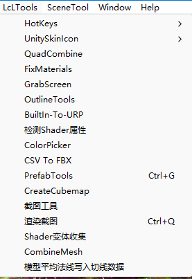

Unity个人常用工具。

一部分由自己开发，一部分来源于其他开发者开发（这里只作为收集，会标明来源）。

## 自己开发的工具：

### LcLShaderGUI

自定义ShaderGUI。

Feature：

- 无限嵌套可折叠区域
- Texture缩略图
- 根据Toggle显示隐藏属性
- 切换Pass

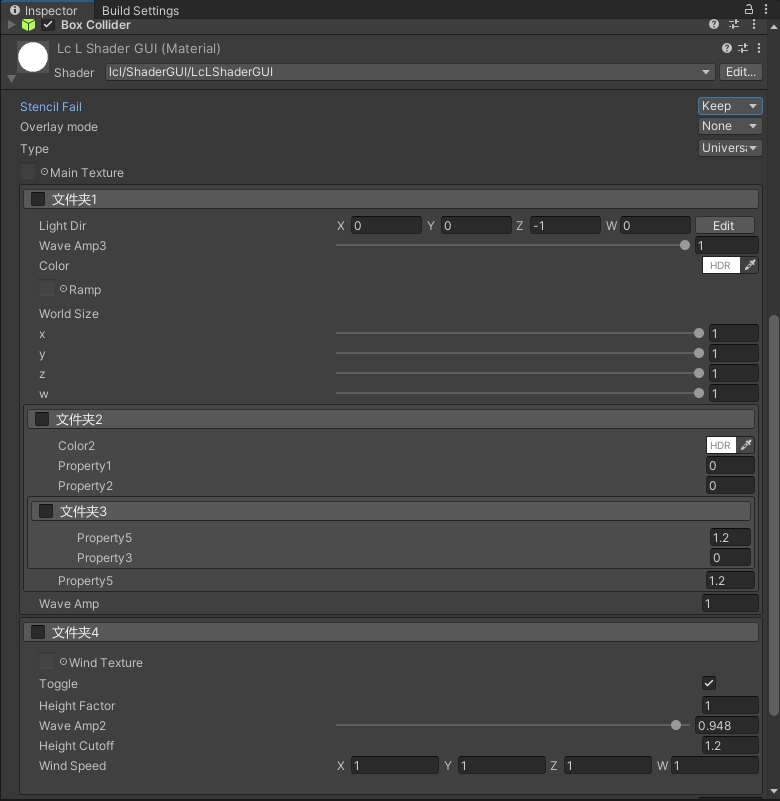

### Shader变体收集工具

创建配置文件：
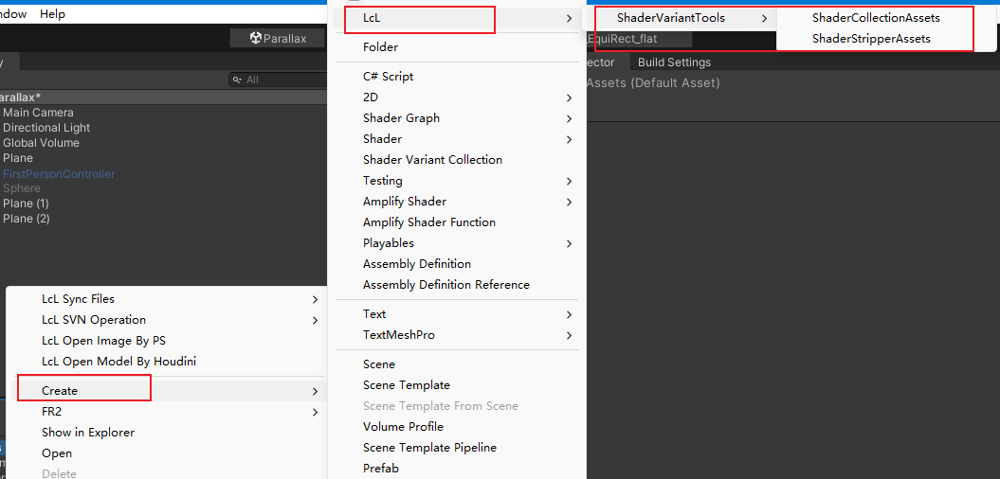

#### Shader变体收集界面：

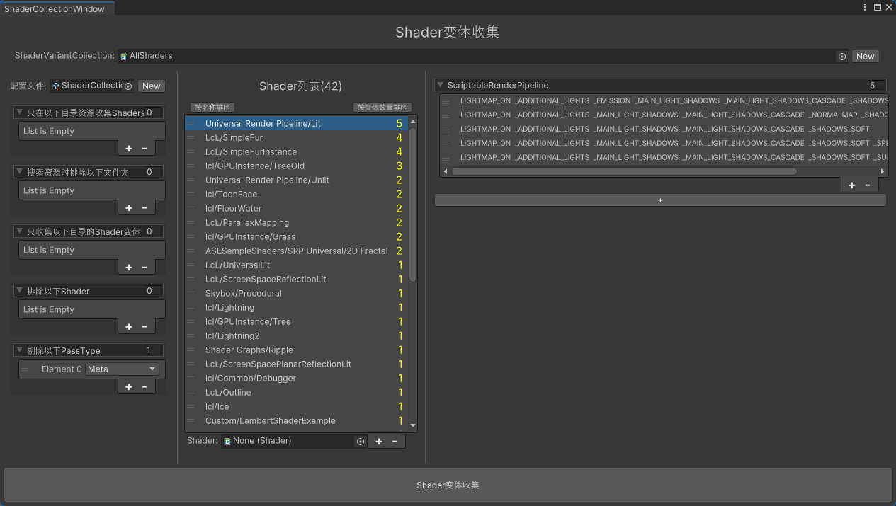

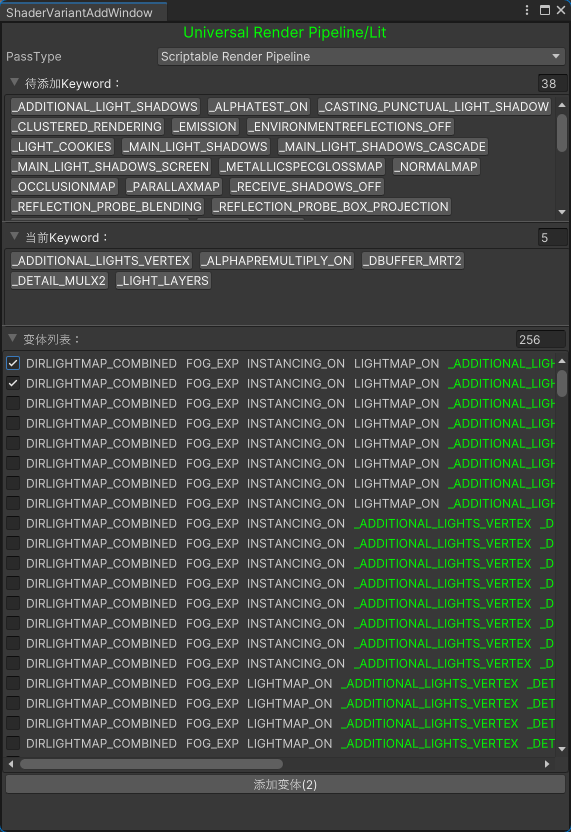

#### Shader变体剔除工具面板：

通过IPreprocessShaders接口实现，Build的时候会根据条件剔除掉冗余的变体。

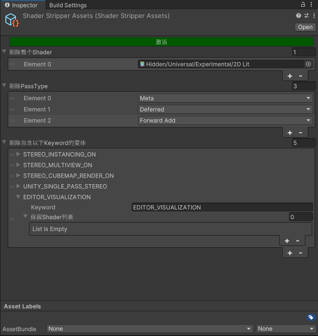

### LcLProfiler

性能分析工具，方便打包后查看一些渲染信息，方便分析性能。

Feature：

- 显示GC Memory
- 显示Memory
- 显示SetPassCalls
- 显示DrawCalls
- 显示Triangles
- 显示Vertices
- 显示GPU、CPU Info
- 显示SRP Batch 相关信息
- 显示电量消耗

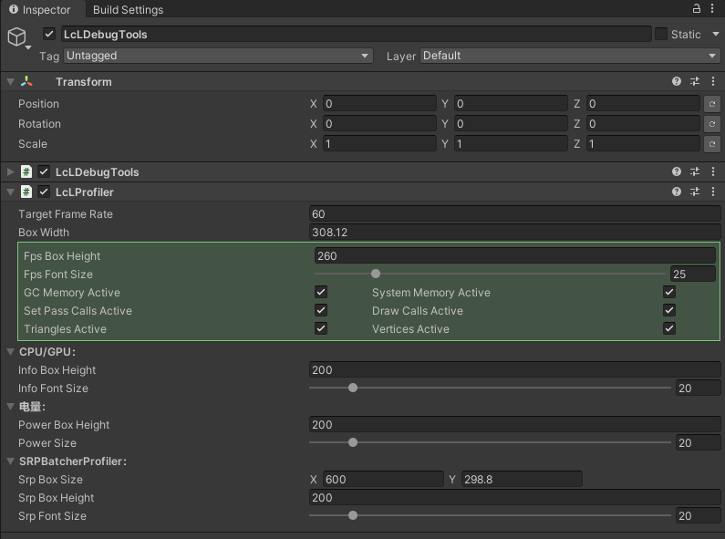

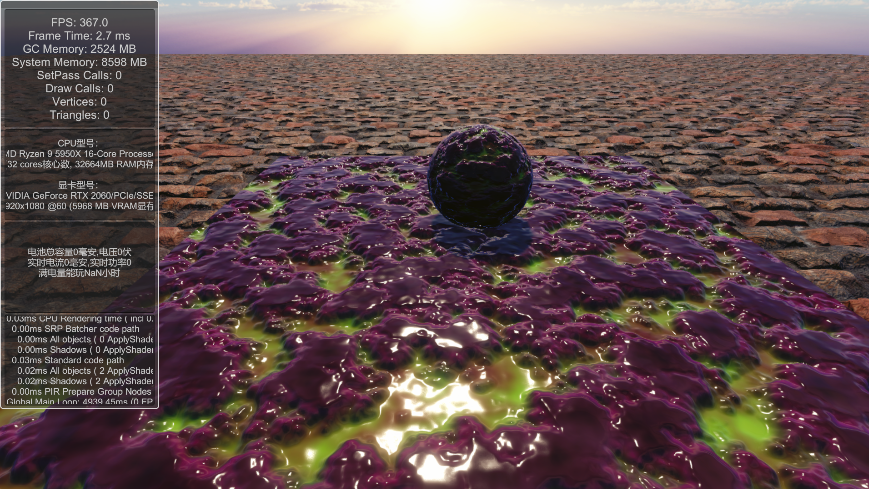

### LcLDebugTools

自制Debug工具，方便打包后测试各种功能，例如切换材质，方便分析某个材质的消耗，配合。

Feature：

- 单选开关
- 多选开关
- 自定义方法调用按钮
- 场景跳转
- Shader LOD切换

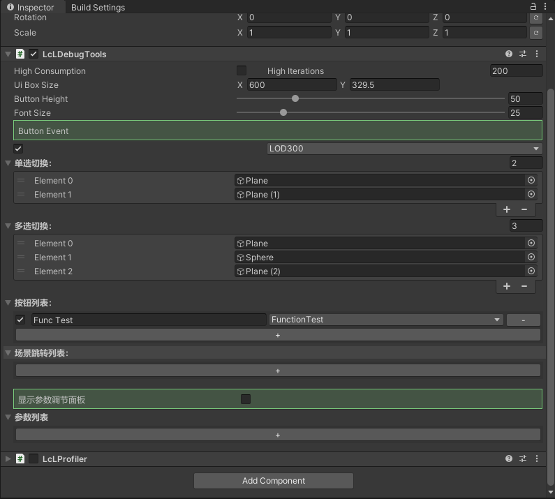

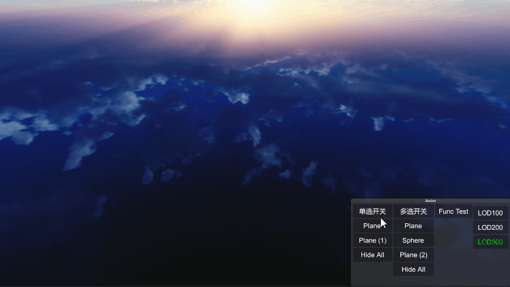

### 截图工具

通过Camera渲染图片并保存下来。

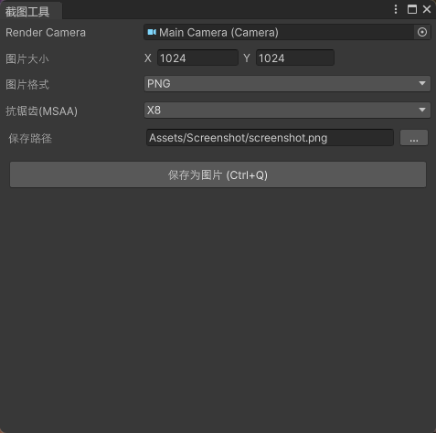

### Unity SVN Tools

在Unity中直接使用SVN命令，快速提交、更新、回退文件等操作。

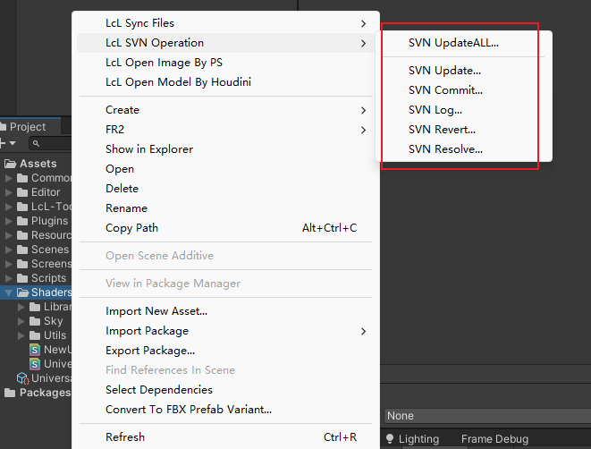

### Unity 文件拷贝工具

最初是方便自己同步不同项目工程的文件，实现文件一键Copy同步到不同的工程。

比如在美术工程修改了Shader，那么需要把修改的Shader文件同步到客户端工程。那么就可以使用该工具一键同步。
需要修改手动脚本里的路径。

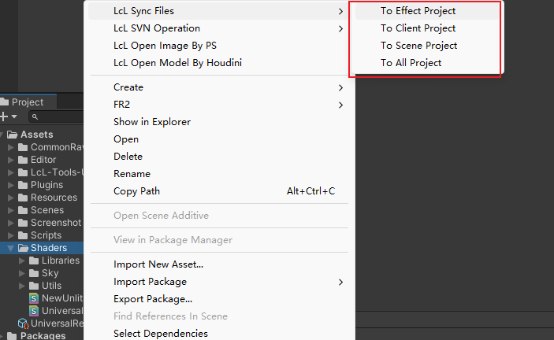

## 非本人开发的工具：

### Unity内置Icon查看器

工具来源：[https://github.com/nukadelic/UnityEditorIcons](https://github.com/nukadelic/UnityEditorIcons)

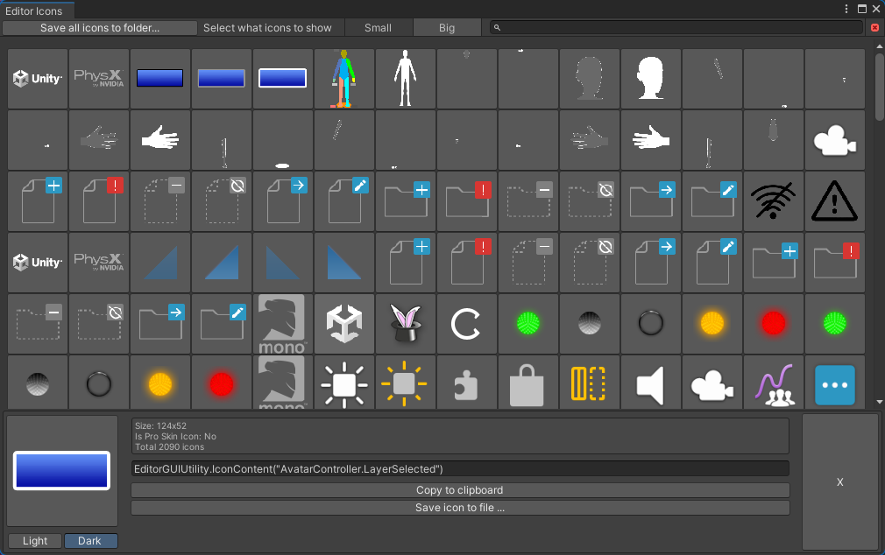

### Unity内置GUI Style查看器

工具来源忘了...有点久远了。

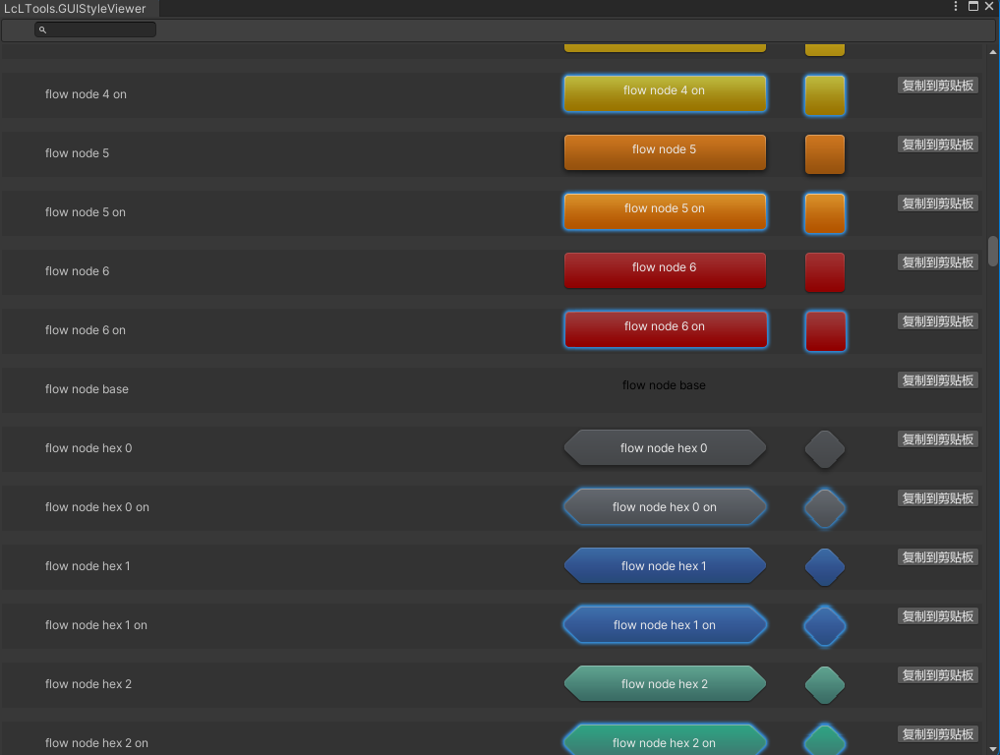

### RenderDoc CSV Convert To FBX Tool

工具来源：[https://github.com/javelinlin/Testing_CSV2Mesh_Tool](https://github.com/javelinlin/Testing_CSV2Mesh_Tool)

将RenderDoc导出的csv文件转换成FBX，在原作者基础上新增了自动映射所有字段、修改字段时候自动应用所有分量。

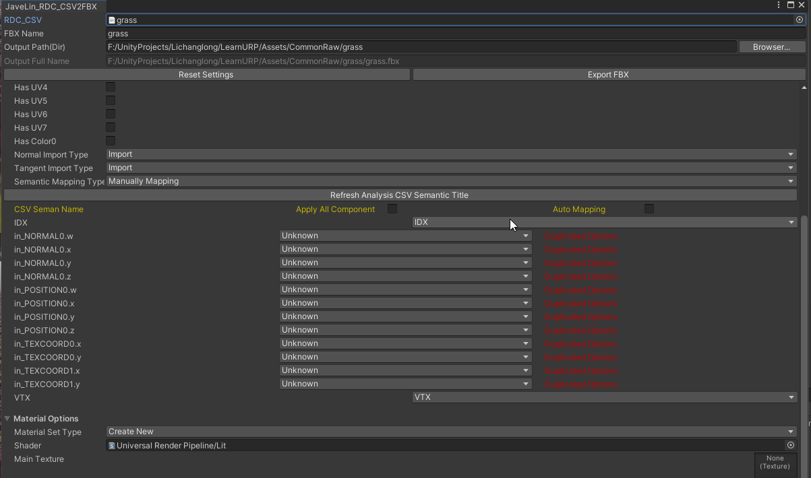

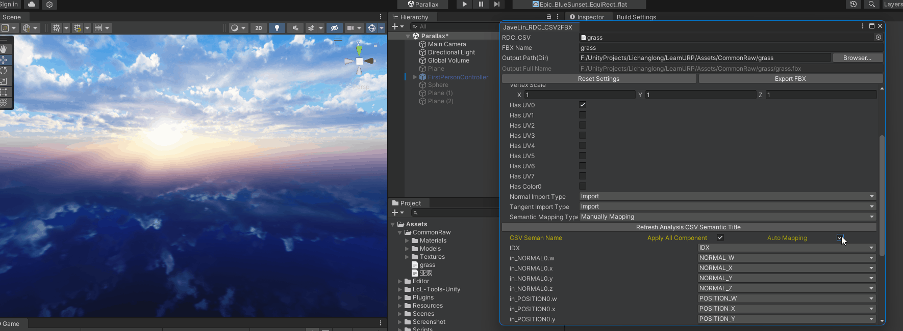

### Built-In Shader Convert To URP Tool

工具具体来源忘了，我在此基础上优化了下，大部分代码片段能正常转换，部分可能需要手动转。

Built In Shader转换为URP Shader工具。

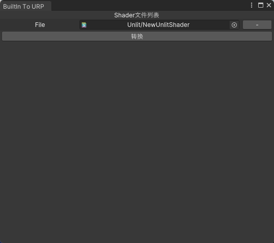
